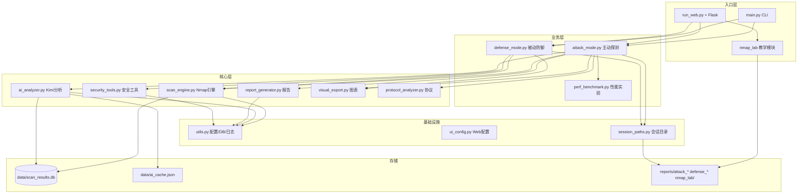
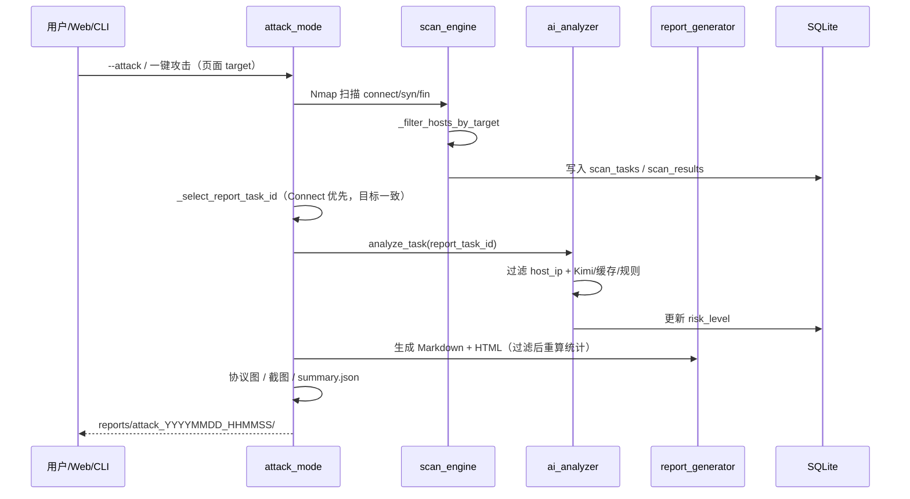
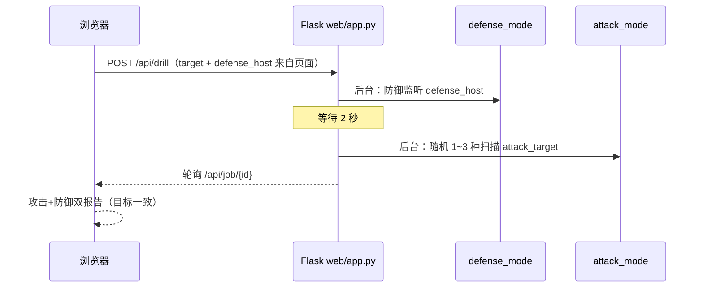
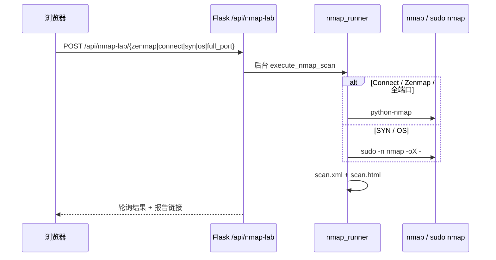

# InsightScan 项目说明（任务书专用）

> 本文档用于课程/任务书答辩：讲清**项目是什么、结构怎样、亮点在哪、流程如何跑通**。  
> 配套文档：[README.md](README.md) · [InsightScan_项目现状.md](InsightScan_项目现状.md) · [InsightScan_完整思路书.md](InsightScan_完整思路书.md) · [环境准备.md](环境准备.md) · [1.md](1.md)–[4.md](4.md) 四人分工

---

## 一、项目定位

**InsightScan** 是一套面向网络安全实验的智能扫描与分析平台，在 Ubuntu 虚拟机上运行，实现：

| 角色 | 能力 |
|------|------|
| **攻击方（主动探测）** | Nmap 多类型扫描 → Kimi AI 风险评估 → 报告与可视化 |
| **防御方（被动防御）** | 被扫描检测、混杂模式检测、iptables 规则自动生成 |
| **实验平台** | 多线程性能对比、协议分析、Web 一键攻防联调、**Nmap 扫描教学** |

**技术栈**：Python 3.10 · Nmap · SQLite · Kimi API（OpenAI SDK）· Flask · matplotlib · psutil

**运行环境**：Ubuntu 22.04 VM，代码目录 `/mnt/hgfs/insightscan`（VMware 共享文件夹，Windows 侧同步开发）

**最近更新（2026-07-07）**：修复攻击报告目标 IP 与开放端口不一致问题；四页目标下拉框统一同步；报告/AI 按扫描目标过滤结果。

---

## 二、整体架构



---

## 三、核心业务流程

### 3.1 主动探测（攻击方）



**一键攻击（Web）**：依次执行 **Connect + SYN + FIN**（`run_attack_suite`），报告基于 **与页面目标一致的 Connect 任务**，末尾附「攻击套件明细」。

**目标 IP 原则**：以主动探测页（或联调页）下拉框为准；IP 配置页只提供本机 IP / C 段选项，不强制覆盖用户自定义目标。

**一键性能测试**：使用与主动探测相同的目标下拉框；C 段 10/50/100 线程对比。

### 3.2 被动防御（防守方）


**检测通道（双通道）**：

1. **syslog / UFW 日志**：识别 Nmap、SYN Flood、UFW BLOCK 等关键字  
2. **数据库联动**：Connect 扫描通常不写 syslog，防御模块查询 `scan_tasks` 表发现近期针对本机的 InsightScan/Nmap 扫描（实验联调的关键）

### 3.3 Web 一键攻防联调



**无需两个终端**：攻击与防御在同一 Flask 进程内并行，时间重叠，便于实验演示。

### 3.4 Nmap 扫描与对比教学（第四 Tab）



**与主引擎关系**：`nmap_lab/` **独立于** `scan_engine.py`，不入 SQLite，专用于实验指导书演示。目标可与 IP 配置页同步。

---

## 四、项目亮点与对应文件

| # | 亮点 | 说明 | 主要体现文件 |
|---|------|------|-------------|
| 1 | **Nmap 三模式扫描** | Connect / SYN / FIN，支持 CIDR 与多线程 | `src/scan_engine.py` |
| 2 | **AI 智能分析** | Kimi 风险评估 + 缓存 + 本地规则降级 | `src/ai_analyzer.py` |
| 3 | **双格式报告** | Markdown + HTML（嵌入 PNG 图表） | `src/report_generator.py`, `src/visual_export.py` |
| 4 | **攻防一体化** | 攻击套件 + 防御检测 + iptables 脚本 | `src/attack_mode.py`, `src/defense_mode.py` |
| 5 | **数据库联动防御** | Connect 扫描也能被防御侧检测到 | `src/security_tools.py` |
| 6 | **性能实验** | 10/50/100 线程 + CPU/内存采样 | `src/perf_benchmark.py` |
| 7 | **协议分析** | TCP/HTTP/FTP 字段标注图 + tshark | `src/protocol_analyzer.py` |
| 8 | **Web 四页控制台** | 攻击 / 防御 / IP 配置 / Nmap 教学 | `web/app.py`, `web/templates/index.html` |
| 9 | **Nmap 扫描教学** | Zenmap 双栏、扫描对比、HTML/XML 报告 | `nmap_lab/` |
| 10 | **动态 IP 配置** | 自动检测网段，四页目标同步 | `src/ui_config.py`, `web/static/js/main.js` |
| 11 | **攻击随机化** | 联调时随机 1~3 种扫描 | `src/attack_mode.py` |
| 12 | **报告目标一致性** | 扫描/AI/报告全链路按 target 过滤；Connect 优先选报告 task | `attack_mode.py`, `report_generator.py`, `ai_analyzer.py` |
| 13 | **可复现实验数据** | 会话独立目录 + summary.json | `src/session_paths.py`, `reports/` |
| 14 | **单元测试** | 扫描/AI/报告/安全模块 | `tests/` |

---

## 五、目录结构与文件职责

```
insightscan/
│
├── main.py                         # CLI 主入口
├── run_web.py                      # Web 入口（端口 8080）
├── requirements.txt
│
├── nmap_lab/                       # Nmap 教学（独立，不入 scan_engine DB）
│   ├── common.py
│   ├── nmap_runner.py              # sudo -n nmap（SYN/OS）
│   ├── zenmap_demo.py
│   └── scan_types_demo.py
│
├── scripts/setup_nmap_sudoers.sh   # SYN/FIN/OS 免密 nmap
│
├── config/
│   ├── settings.json
│   ├── ui_settings.json            # Web：本机 IP、C 段、默认目标
│   └── api_keys.json               # gitignore
│
├── src/
│   ├── scan_engine.py              # Nmap、多线程、_filter_hosts_by_target
│   ├── ai_analyzer.py              # Kimi、缓存、_filter_rows_by_target
│   ├── report_generator.py         # MD/HTML、_filter_results_by_target
│   ├── attack_mode.py              # run_attack_suite、_select_report_task_id
│   ├── defense_mode.py             # 监控、本机自查 save_db=False
│   ├── security_tools.py
│   ├── perf_benchmark.py
│   ├── protocol_analyzer.py
│   ├── visual_export.py
│   ├── ui_config.py                # resolve_target
│   └── session_paths.py
│
├── web/
│   ├── app.py                      # /api/attack /defense /drill /nmap-lab
│   ├── templates/index.html        # 四 Tab
│   └── static/js/main.js           # attackTargetPrefs 四下拉框同步
│
├── data/                           # scan_results.db、ai_cache.json、log
├── reports/                        # attack_* / defense_* / nmap_lab/
├── tests/
└── 文档/ + 1.md–4.md（四人分工）
```

---

## 六、数据库与 API 说明

### 6.1 SQLite 表（`data/scan_results.db`）

| 表 | 用途 |
|----|------|
| `scan_tasks` | 每次扫描：目标、类型、时间、状态、统计 |
| `scan_results` | 每个开放端口：服务、Banner、风险、AI JSON |
| `scan_history` | 端口变更（`--compare-with`） |

### 6.2 Kimi API 调用链

```
attack_mode._select_report_task_id()
  └─ AIAnalyzer.analyze_task(task_id)   # 先按 target 过滤 rows
       └─ analyze_ports_batch()
            ├─ ai_cache.json 命中
            ├─ OpenAI SDK → api.moonshot.cn
            └─ LOCAL_RISK_RULES 降级
```

---

## 七、实验任务与命令对照

| 实验编号 | 内容 | 命令 / 操作 | 产出 |
|---------|------|------------|------|
| EXP-01 | Connect 扫描 | Web/CLI、`nmap_lab` | DB + 报告 |
| EXP-02 | SYN 扫描 | Nmap Tab（sudo 免密 nmap） | scan.html + scan.xml |
| EXP-03 | FIN 扫描 | 攻击套件 / `sudo main.py --scan-type fin` | 需 root 或 sudoers |
| EXP-03+ | Zenmap / 对比 | Web 第四 Tab | reports/nmap_lab/ |
| EXP-04 | 多线程性能 | Web 性能测试 / `--perf` | perf_benchmark.md |
| EXP-05 | 协议分析 | 攻击模式自动 | protocol_*.png |
| 攻防联调 | 攻击+防御重叠 | Web「一键攻防联调」 | attack_* + defense_* |
| **目标验证** | 自定义不可达 IP | 扫 `1.2.3.4` | 报告 0 端口、目标正确 |
| 安全实验 | iptables | `--defense` → `sudo bash iptables_defense.sh` | 防火墙规则 |

---

## 八、Web 控制台功能一览

| Tab | 按钮 | 行为 |
|-----|------|------|
| 主动探测 | 一键攻防联调 | 防御 60s → 2s 后随机 1~3 种攻击；**目标以本页下拉为准** |
| 主动探测 | 一键攻击 | Connect + SYN + FIN 全套 |
| 主动探测 | 一键性能测试 | 同页目标 + 10/50/100 线程 |
| 被动防御 | 一键攻防联调 / 一键防御 | 监听 IP = 页面攻击目标 |
| IP 配置 | 检测并应用 | 同步四页目标 + Nmap 教学页 |
| Nmap 教学 | 五按钮 + 从 IP 配置同步 | scan.html；SYN/OS 需 sudo 免密 |

启动：`python3 run_web.py`（**普通用户**）→ `http://<VM_IP>:8080`  
改前端后：**Ctrl+Shift+R** 硬刷新（`main.js?v=20260707f`）。

---

## 九、答辩时可强调的「完成了什么」

1. **完整闭环**：扫描 → 过滤 → AI 分析 → 报告 → 存储 → 可视化。  
2. **AI 落地**：Kimi 风险分级 + 缓存降级 + 来源标注。  
3. **攻防实验**：Web 单页联调 + DB 联动防御 + 目标 IP 前后端一致。  
4. **Nmap 教学**：第四 Tab 模拟 Zenmap，与 InsightScan AI 增强对照。  
5. **工程化**：模块化、文档齐全、密钥 gitignore、四人分工文档 1–4。  
6. **报告可信**：攻击报告目标与端口全链路校验，避免本机端口串台。

---

## 十、文档阅读顺序（建议）

| 顺序 | 文档 | 适合谁 |
|------|------|--------|
| 1 | [环境准备.md](环境准备.md) | 首次搭环境 |
| 2 | [README.md](README.md) | 安装、命令、sudo nmap |
| 3 | **本文档** | 任务书、答辩 |
| 4 | [InsightScan_项目现状.md](InsightScan_项目现状.md) | 验收、已知问题、2026-07-07 修复 |
| 5 | [InsightScan_完整思路书.md](InsightScan_完整思路书.md) | 模块设计与实现细节 |
| 6 | [1.md](1.md)–[4.md](4.md) | 组员分工 |

---

*InsightScan · 智能网络扫描与自动化分析 · 2026 · 更新 2026-07-07*
