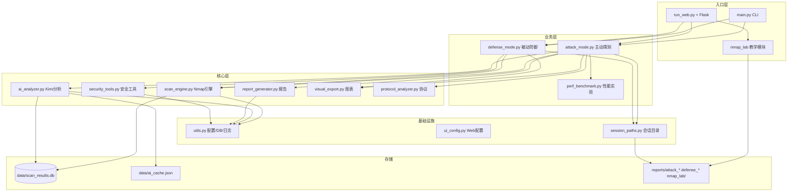
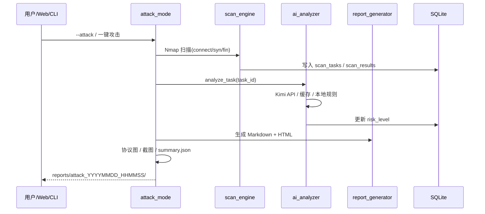
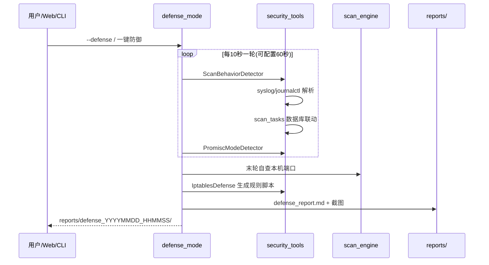
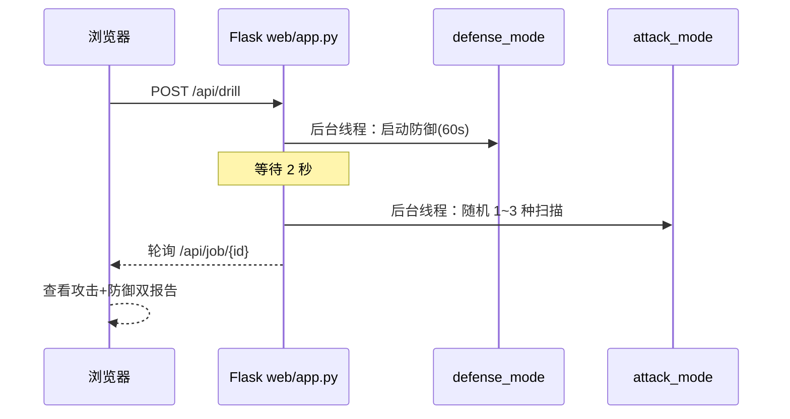
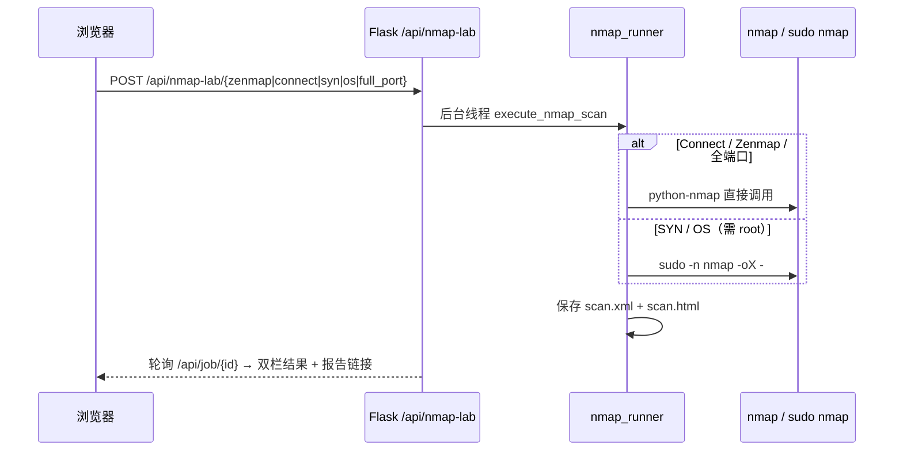

# InsightScan 项目说明（任务书专用）

> 本文档用于课程/任务书答辩：讲清**项目是什么、结构怎样、亮点在哪、流程如何跑通**。  
> 配套文档：[README.md](README.md) · [InsightScan_项目现状.md](InsightScan_项目现状.md) · [InsightScan_完整思路书.md](InsightScan_完整思路书.md) · [环境准备.md](环境准备.md)

---

## 一、项目定位

**InsightScan** 是一套面向网络安全实验的智能扫描与分析平台，在 Ubuntu 虚拟机上运行，实现：

| 角色 | 能力 |
|------|------|
| **攻击方（主动探测）** | Nmap 多类型扫描 → Kimi AI 风险评估 → 报告与可视化 |
| **防御方（被动防御）** | 被扫描检测、混杂模式检测、iptables 规则自动生成 |
| **实验平台** | 多线程性能对比、协议分析、Web 一键攻防联调、**Nmap 扫描教学** |

**技术栈**：Python 3.10 · Nmap · SQLite · Kimi API（OpenAI SDK）· Flask · matplotlib · psutil

**运行环境**：Ubuntu 22.04 VM，代码目录 `/mnt/hgfs/insightscan`（VMware 共享文件夹，Windows 侧同步开发）

---

## 二、整体架构



---

## 三、核心业务流程

### 3.1 主动探测（攻击方）



**一键攻击（Web）**：依次执行 **Connect + SYN + FIN** 三种扫描（`run_attack_suite`），报告末尾附「攻击套件明细」。

**一键性能测试**：C 段 10/50/100 线程对比，输出 `perf_benchmark.md` 与 CPU/内存曲线。

### 3.2 被动防御（防守方）



**检测通道（双通道）**：

1. **syslog / UFW 日志**：识别 Nmap、SYN Flood、UFW BLOCK 等关键字  
2. **数据库联动**：Connect 扫描通常不写 syslog，防御模块查询 `scan_tasks` 表发现近期针对本机的 InsightScan/Nmap 扫描（实验联调的关键）

### 3.3 Web 一键攻防联调



**无需两个终端**：攻击与防御在同一 Flask 进程内并行，时间重叠，便于实验演示。

### 3.4 Nmap 扫描与对比教学（第四 Tab）



**与主引擎关系**：`nmap_lab/` **独立于** `scan_engine.py`，不入 SQLite，专用于实验指导书演示。

**SYN/OS 权限**：VM 配置 `sudo NOPASSWD: /usr/bin/nmap` 后，Web 仍用普通用户 `python3 run_web.py` 启动。详见 [README.md](README.md#nmap-教学与-synos-权限配置)。

**Zenmap vs InsightScan**：页内静态对比 + 可选「InsightScan 增强分析」（走主动探测 Connect + Kimi AI）。

---

## 四、项目亮点与对应文件

| # | 亮点 | 说明 | 主要体现文件 |
|---|------|------|-------------|
| 1 | **Nmap 三模式扫描** | Connect / SYN / FIN，支持 CIDR 与多线程 | `src/scan_engine.py` |
| 2 | **AI 智能分析** | Kimi API 风险评估 + 结果缓存 + 本地规则降级 | `src/ai_analyzer.py`, `config/api_keys.json` |
| 3 | **双格式报告** | Markdown + HTML（嵌入 PNG 图表） | `src/report_generator.py`, `src/visual_export.py` |
| 4 | **攻防一体化** | 攻击套件 + 防御检测 + iptables 脚本 | `src/attack_mode.py`, `src/defense_mode.py`, `src/security_tools.py` |
| 5 | **数据库联动防御** | Connect 扫描也能被防御侧检测到 | `src/security_tools.py` `_detect_from_scan_database()` |
| 6 | **性能实验** | 10/50/100 线程 + CPU/内存采样 | `src/perf_benchmark.py` |
| 7 | **协议分析** | TCP/HTTP/FTP 字段标注图 + tshark 抓包 | `src/protocol_analyzer.py` |
| 8 | **Web 四页控制台** | 攻击 / 防御 / IP 配置 / Nmap 教学 | `web/app.py`, `web/templates/index.html` |
| 9 | **Nmap 扫描教学** | Zenmap 双栏、四种扫描对比、HTML/XML 报告、sudo nmap | `nmap_lab/` |
| 10 | **动态 IP 配置** | 自动检测网段，保存后各页同步 | `src/ui_config.py` |
| 11 | **攻击随机化** | 联调时随机 1~3 种扫描 | `src/attack_mode.py` |
| 12 | **可复现实验数据** | 会话独立目录 + summary.json | `src/session_paths.py`, `reports/` |
| 13 | **单元测试** | 扫描/AI/报告/安全模块 | `tests/` |

---

## 五、目录结构与文件职责

```
insightscan/
│
├── main.py                         # CLI 主入口：扫描、AI、报告、--attack、--defense
├── run_web.py                      # Web 入口：启动 Flask 控制台（端口 8080）
├── requirements.txt                # Python 依赖清单
├── .gitignore                      # 忽略密钥、报告、数据库、venv
│
├── nmap_lab/                       # Nmap 教学（独立，不入 scan_engine DB）
│   ├── common.py                   # 路径、XML/HTML 保存、权限检测、对比表
│   ├── nmap_runner.py              # 普通扫描 + sudo -n nmap（SYN/OS）
│   ├── zenmap_demo.py              # Zenmap 风格 CLI
│   └── scan_types_demo.py          # Connect/SYN/OS/全端口对比 CLI
│
├── scripts/
│   └── setup_nmap_sudoers.sh       # 配置 sudo 免密 nmap（可选）
│
├── config/
│   ├── settings.json               # 全局：扫描线程、AI 模型、安全策略、perf C 段
│   ├── ui_settings.json            # Web：本机 IP、C 段、默认目标、端口（可页面修改）
│   ├── api_keys.json.example       # API Key 模板（提交 Git）
│   └── api_keys.json               # 实际密钥（gitignore，Kimi API）
│
├── src/
│   ├── utils.py                    # 配置读取、日志、SQLite 初始化、IP/端口校验、本地时间
│   ├── scan_engine.py              # Nmap 调用、多线程 CIDR 扫描、XML 解析、入库
│   ├── ai_analyzer.py              # Kimi 单端口/批量分析、缓存、本地规则库、历史对比
│   ├── report_generator.py         # Markdown/HTML 报告、风险统计、AI 来源说明
│   ├── attack_mode.py              # 主动探测：单扫描 + run_attack_suite 攻击套件
│   ├── defense_mode.py             # 被动防御：监控循环、报告、iptables 脚本
│   ├── security_tools.py           # 扫描行为检测、混杂模式、iptables 规则生成
│   ├── perf_benchmark.py           # 10/50/100 线程性能实验与图表
│   ├── protocol_analyzer.py        # 协议字段标注图、tshark 抓包
│   ├── visual_export.py            # 风险饼图、端口柱图、攻击时间线、混杂模式图
│   ├── ui_config.py                # Web 配置读写、resolve_target、ip addr 自动检测
│   └── session_paths.py            # 创建 reports/attack_* 与 defense_* 会话目录
│
├── web/
│   ├── app.py                      # Flask 路由：/api/attack /api/defense /api/drill /api/nmap-lab/*
│   ├── templates/index.html        # 四 Tab：主动探测、被动防御、IP 配置、Nmap 教学
│   └── static/
│       ├── css/style.css           # 深色主题 UI
│       └── js/main.js              # 前端逻辑：目标选择、任务轮询、配置同步
│
├── data/                           # 运行时（gitignore 内容，保留 .gitkeep）
│   ├── scan_results.db             # SQLite：scan_tasks、scan_results、scan_history
│   ├── ai_cache.json               # AI 分析缓存（相同服务版本不重复调 API）
│   └── insightscan.log             # 运行日志
│
├── reports/                        # 实验报告输出（gitignore）
│   ├── attack_YYYYMMDD_HHMMSS/     # 攻击会话：报告、截图、summary、perf（可选）
│   ├── defense_YYYYMMDD_HHMMSS/    # 防御会话：报告、iptables 脚本、事件 JSON
│   └── nmap_lab/                   # Nmap 教学：scan.html + scan.xml
│
├── tests/                          # 单元测试
│   ├── test_utils.py
│   ├── test_scan_engine.py
│   ├── test_ai_analyzer.py
│   ├── test_report.py
│   ├── test_security.py
│   └── test_scan.py
│
└── 文档/
    ├── README.md                   # 安装、命令、快速开始
    ├── InsightScan_项目说明.md      # 本文档（任务书 / 答辩）
    ├── InsightScan_项目现状.md      # 进度、验收数据、已知问题
    ├── InsightScan_完整思路书.md    # 原始 AI 辅助设计文档
    └── 环境准备.md                  # Ubuntu + 共享文件夹环境搭建
```

---

## 六、数据库与 API 说明

### 6.1 SQLite 表（`data/scan_results.db`）

| 表 | 用途 |
|----|------|
| `scan_tasks` | 每次扫描任务：目标、类型、时间、状态、主机/端口统计 |
| `scan_results` | 每个开放端口：服务、版本、Banner、风险等级、AI 分析 JSON |
| `scan_history` | 端口状态变更历史（用于 `--compare-with`） |

### 6.2 Kimi API 调用链

```
attack_mode.py
  └─ AIAnalyzer.analyze_task(task_id)
       └─ analyze_ports_batch()
            ├─ 命中 ai_cache.json → 不调 API（报告标注「缓存命中」）
            ├─ 调用 OpenAI SDK → api.moonshot.cn → kimi-k2.6
            └─ 失败 → LOCAL_RISK_RULES 本地规则降级
```

密钥文件：`config/api_keys.json`（字段 `kimi_api_key`、`base_url`）

---

## 七、实验任务与命令对照

| 实验编号 | 内容 | 命令 / 操作 | 产出 |
|---------|------|------------|------|
| EXP-01 | Connect 扫描 | `main.py -t 目标 --scan-type connect` 或 Web/CLI `nmap_lab` | DB + 报告 / XML |
| EXP-02 | SYN 扫描 | Web Nmap Tab / `nmap_lab`（需 sudo 免密 nmap） | scan.html + scan.xml |
| EXP-03 | FIN 扫描 | `sudo main.py --scan-type fin` | 需 root |
| EXP-03+ | Zenmap / 扫描对比 | Web「Nmap扫描与对比教学」/ CLI `nmap_lab/` | reports/nmap_lab/ |
| EXP-04 | 多线程性能 | `main.py --attack -t C段 --perf` | perf_benchmark.md |
| EXP-05 | 协议分析 | 攻击模式自动生成 | protocol_*.png, capture.pcap |
| 攻防联调 | 攻击+防御重叠 | Web「一键攻防联调」 | attack_* + defense_* |
| 安全实验 | iptables | `main.py --defense` → `sudo bash iptables_defense.sh` | 防火墙规则 |

---

## 八、Web 控制台功能一览

| Tab | 按钮 | 行为 |
|-----|------|------|
| 主动探测 | 一键攻防联调 | 先防御 60s → 2s 后随机 1~3 种攻击 |
| 主动探测 | 一键攻击 | Connect + SYN + FIN 全套 |
| 主动探测 | 一键性能测试 | C 段 10/50/100 线程 |
| 被动防御 | 一键攻防联调 | 同上（可自选目标） |
| 被动防御 | 一键防御 | 接续进行中攻击，或自动联调 |
| IP 配置 | 检测并应用 | `ip addr` 自动填本机 IP / C 段，各页同步 |
| Nmap扫描与对比教学 | Zenmap / Connect / SYN / OS / 全端口 | 独立按钮；SYN/OS 需 sudo 免密 nmap；输出 scan.html |

启动：`python3 run_web.py`（**普通用户**）→ `http://<VM_IP>:8080`

---

## 九、答辩时可强调的「完成了什么」

1. **完整闭环**：扫描 → 分析 → 报告 → 存储 → 可视化。  
2. **AI 落地**：Kimi 风险分级 + 缓存降级 + 来源标注。  
3. **攻防实验**：Web 单页联调 + DB 联动防御。  
4. **Nmap 教学**：第四 Tab 模拟 Zenmap，对比 Connect/SYN/OS/全端口，与 InsightScan AI 增强对照。  
5. **工程化**：模块化、文档齐全、密钥 gitignore。

---

## 十、文档阅读顺序（建议）

| 顺序 | 文档 | 适合谁 |
|------|------|--------|
| 1 | [环境准备.md](环境准备.md) | 首次搭环境 |
| 2 | [README.md](README.md) | 安装、命令速查 |
| 3 | **本文档** | 任务书、答辩、整体理解 |
| 4 | [InsightScan_项目现状.md](InsightScan_项目现状.md) | 验收数据、已知问题 |
| 5 | [InsightScan_完整思路书.md](InsightScan_完整思路书.md) | 原始设计与模块细节 |

---

*InsightScan · 智能网络扫描与自动化分析 · 2026*
